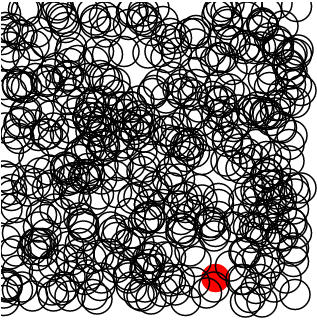

[abstract games](http://omardelarosa.github.io/abstract_games/)
===============

These abstract games are experiments utilizing various javascript SVG libraries such as Raphael and KineticJS.

[circle finder](http://omardelarosa.github.io/abstract_games/circle_finder/)
----------

Move your circle with the up/down/left/right arrow keys and touch the other circles to give them color.  Press spacebar to make more circles.